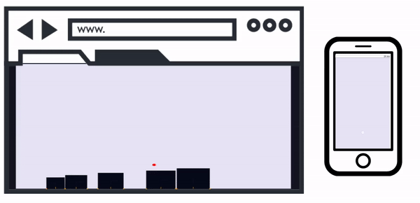
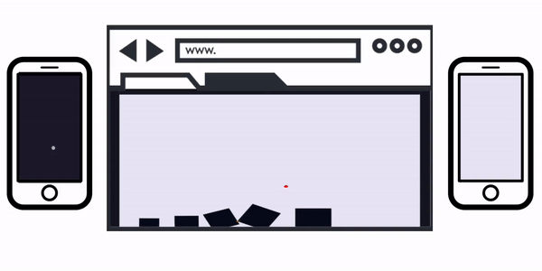
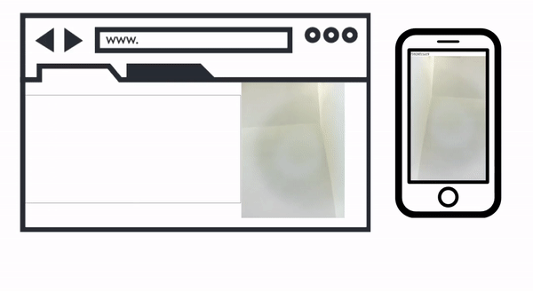

## Demos ##

### Tiny Platformer ###
Tiny platformer game with NES controller. Collect the gold coins and jump on the enemies to beat the level.  

Try the [tiny platformer](https://JeherillaJanwar.github.io/phoneControl-v2/demo/tinyPlatformer/index.html)

### 3D racing ###
3D racing game controlled with phone joystick. Use the joystick to steer, brake and jump. How many points can you score before the time runs out?  

Try the [3D Racer](https://JeherillaJanwar.github.io/phoneControl-v2/demo/3dRacing.html)

### Physics simulator ###
A physics simulator created with Matterjs. Use the touchpad to select and stack blocks.  

Try the [physics simulator](https://JeherillaJanwar.github.io/phoneControl-v2/physics/physicsDemoV3.html)

### Multiplayer Physics simulator ###
Multiplayer tower building. This demo requires two people to connect. Both players will need to cooperate by selecting the same block to be able to carry it.  

Try the [cooperative physics simulator](https://JeherillaJanwar.github.io/phoneControl-v2/physics/physicsDemoV4.html)

### Handtracking ###
This demo lets you stream a video into browers that will track your hand to control the ball. 
See the cource code: [game](https://github.com/JeherillaJanwar/phoneControl-v2/blob/main/handtracking/receiveVideo.html) and [video stream](https://github.com/JeherillaJanwar/phoneControl-v2/blob/main/handtracking/sendVideo.html) 
OR  
Try the [hand tracking](https://JeherillaJanwar.github.io/phoneControl-v2/handtracking/receiveVideo.html)

